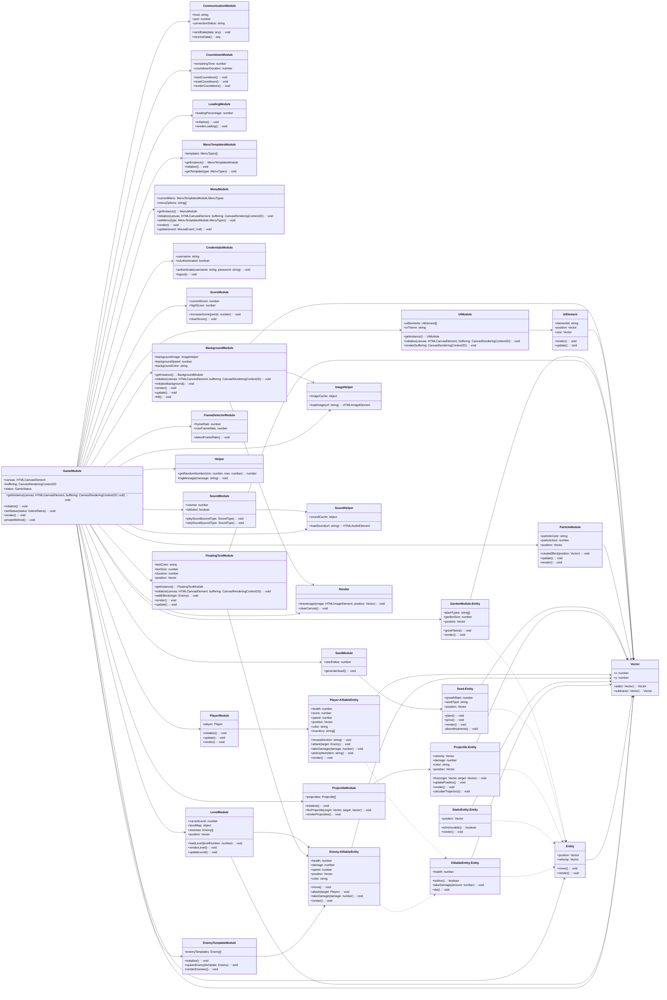

```mermaid
classDiagram
    direction LR
    class Entity {
        +position: Vector
        +velocity: Vector
        +move(): void
        +render(): void
    }

    class KillableEntity["KillableEntity:Entity"] {
        +health: number
        +isAlive(): boolean
        +takeDamage(amount: number): void
        +die(): void
    }

    class StaticEntity["StaticEntity:Entity"] {
        +position: Vector
        +isImmovable(): boolean
        +render(): void
    }

    class Enemy["Enemy:KillableEntity"] {
        +health: number
        +damage: number
        +speed: number
        +position: Vector
        +color: string

        +move(): void
        +attack(target: Player): void
        +takeDamage(damage: number): void
        +render(): void
    }

    class Player["Player:KillableEntity"] {
        +health: number
        +score: number
        +speed: number
        +position: Vector
        +color: string
        +inventory: string[]

        +move(direction: string): void
        +attack(target: Enemy): void
        +takeDamage(damage: number): void
        +pickUpItem(item: string): void
        +render(): void
    }

    class Projectile["Projectile:Entity"] {
        +velocity: Vector
        +damage: number
        +color: string
        +position: Vector

        +fire(origin: Vector, target: Vector): void
        +updatePosition(): void
        +render(): void
        -calculateTrajectory(): void
    }

    class Seed["Seed:Entity"] {
        +growthRate: number
        +seedType: string
        +position: Vector

        +plant(): void
        +grow(): void
        +render(): void
        -absorbNutrients(): void
    }

    class Vector {
        +x: number
        +y: number
        +add(v: Vector): Vector
        +subtract(v: Vector): Vector
    }

    class GameModule {
        +canvas: HTMLCanvasElement
        +buffering: CanvasRenderingContext2D
        +status: GameStatus

        +getInstance(canvas: HTMLCanvasElement, buffering: CanvasRenderingContext2D | null): void
        +initialize(): void
        +setStatus(status: GameStatus): void
        +render(): void
        -privateMethod(): void
    }

    class CommunicationModule {
        +host: string
        +port: number
        -connectionStatus: string

        +sendData(data: any): void
        +receiveData(): any
    }

    class CountdownModule {
        +remainingTime: number
        +countdownDuration: number

        +startCountdown(): void
        +resetCountdown(): void
        +renderCountdown(): void
    }

    class LoadingModule {
        +loadingPercentage: number

        +initialize(): void
        +renderLoading(): void
    }

    class MenuTemplatesModule {
        +templates: MenuTypes[]

        +getInstance(): MenuTemplatesModule
        +initialize(): void
        +getTemplate(type: MenuTypes): void
    }

    class MenuModule {
        +currentMenu: MenuTemplatesModule.MenuTypes
        +menuOptions: string[]

        +getInstance(): MenuModule
        +initialize(canvas: HTMLCanvasElement, buffering: CanvasRenderingContext2D): void
        +setMenu(type: MenuTemplatesModule.MenuTypes): void
        +render(): void
        +update(event: MouseEvent | null): void
    }

    class CredentialsModule {
        +username: string
        +isAuthenticated: boolean

        +authenticate(username: string, password: string): void
        +logout(): void
    }

    class ParticleModule {
        +particleColor: string
        +particleSize: number
        +position: Vector

        +createEffect(position: Vector): void
        +update(): void
        +render(): void
    }

    class ScoreModule {
        +currentScore: number
        +highScore: number

        +increaseScore(points: number): void
        +resetScore(): void
    }

    class SeedModule {
        +seedValue: number

        +generateSeed(): void
    }

    class SoundModule {
        +volume: number
        +isMuted: boolean

        +playSound(soundType: SoundType): void
        +stopSound(soundType: SoundType): void
    }

    class UiModule {
        +uiElements: UiElement[]
        +uiTheme: string

        +getInstance(): UiModule
        +initialize(canvas: HTMLCanvasElement, buffering: CanvasRenderingContext2D): void
        +render(buffering: CanvasRenderingContext2D): void
    }

    class FloatingTextModule {
        +textColor: string
        +textSize: number
        +duration: number
        +position: Vector

        +getInstance(): FloatingTextModule
        +initialize(canvas: HTMLCanvasElement, buffering: CanvasRenderingContext2D): void
        +addEffect(origin: Enemy): void
        +render(): void
        +update(): void
    }

    class FrameDetectorModule {
        +frameRate: number
        +maxFrameRate: number

        +detectFrameRate(): void
    }

    class BackgroundModule {
        +backgroundImage: ImageHelper
        +backgroundSpeed: number
        +backgroundColor: string

        +getInstance(): BackgroundModule
        +initialize(canvas: HTMLCanvasElement, buffering: CanvasRenderingContext2D): void
        +initializeBackground(): void
        +render(): void
        +update(): void
        +kill(): void
    }

    class GardenModule["GardenModule:Entity"] {
        +plantTypes: string[]
        +gardenSize: number
        +position: Vector

        +growPlants(): void
        +render(): void
    }

    class Helper {
        +getRandomNumber(min: number, max: number): number
        +logMessage(message: string): void
    }

    class ImageHelper {
        +imageCache: object

        +loadImage(url: string): HTMLImageElement
    }

    class SoundHelper {
        +soundCache: object

        +loadSound(url: string): HTMLAudioElement
    }

    class PlayerModule {
        +player: Player
        +initialize(): void
        +update(): void
        +render(): void
    }

    class EnemyTemplateModule {
        +enemyTemplates: Enemy[]
        +initialize(): void
        +spawnEnemy(template: Enemy): void
        +renderEnemies(): void
    }

    class ProjectileModule {
        +projectiles: Projectile[]
        +initialize(): void
        +fireProjectile(origin: Vector, target: Vector): void
        +renderProjectiles(): void
    }

    class LevelModule {
        +currentLevel: number
        +levelMap: object
        +enemies: Enemy[]
        +position: Vector

        +loadLevel(levelNumber: number): void
        +renderLevel(): void
        +updateLevel(): void
    }

    class Render {
        +drawImage(image: HTMLImageElement, position: Vector): void
        +clearCanvas(): void
    }

    class UiElement {
        +elementId: string
        +position: Vector
        +size: Vector

        +render(): void
        +update(): void
    }

    GameModule --> CredentialsModule
    GameModule --> CommunicationModule
    GameModule --> CountdownModule
    GameModule --> LoadingModule
    GameModule --> MenuTemplatesModule
    GameModule --> MenuModule
    GameModule --> UiModule    
    GameModule --> PlayerModule
    GameModule --> EnemyTemplateModule
    GameModule --> LevelModule
    GameModule --> ProjectileModule
    GameModule --> ParticleModule
    GameModule --> BackgroundModule
    GameModule --> GardenModule
    GameModule --> SeedModule
    GameModule --> ScoreModule
    GameModule --> SoundModule
    GameModule --> FloatingTextModule
    GameModule --> FrameDetectorModule
    GameModule --> Helper
    GameModule --> ImageHelper
    GameModule --> SoundHelper
    GameModule --> Entity
    GameModule --> Render
    GameModule --> Vector

    PlayerModule --> Player
    EnemyTemplateModule --> Enemy
    ProjectileModule --> Projectile
    FloatingTextModule --> Enemy
    BackgroundModule --> ImageHelper
    BackgroundModule --> Render
    UiModule --> UiElement
    SoundModule --> SoundHelper
    SeedModule --> Seed
    LevelModule --> Enemy
    LevelModule --> Vector
    Entity --> Vector
    KillableEntity --> Vector
    StaticEntity --> Vector
    Enemy --> Vector
    Player --> Vector
    Projectile --> Vector
    Seed --> Vector
    ParticleModule --> Vector
    FloatingTextModule --> Vector
    GardenModule --> Vector
    UiElement --> Vector
    BackgroundModule --> Vector

    KillableEntity ..> Entity
    StaticEntity ..> Entity
    Enemy ..> KillableEntity
    Player ..> KillableEntity
    Projectile ..> Entity
    Seed ..> Entity
    GardenModule ..> Entity
```
